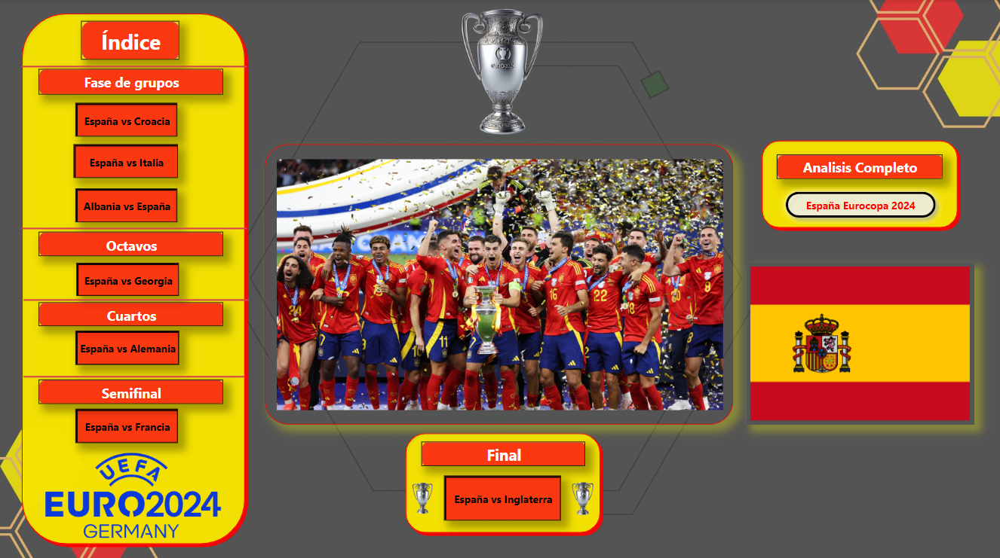

# Análisis de la Participación de la Selección de España en la Eurocopa 2024

Este repositorio contiene el análisis detallado de la participación de la selección de fútbol de España en la Eurocopa 2024. Se realiza un análisis individual de cada partido y un resumen general de su desempeño en el torneo.

## Contenidos del Repositorio

- **Partidos**: Carpeta que contiene análisis individuales de cada partido jugado por España.
  - `partido1.md`: Análisis del primer partido.
  - `partido2.md`: Análisis del segundo partido.
  - ...
- **Resumen**: Archivo que contiene el resumen general de la participación de España.
  - `resumen.md`: Resumen del desempeño de España en la Eurocopa 2024.
- **Datos**: Carpeta con los datos utilizados para los análisis.
  - `estadisticas_partidos.csv`: Estadísticas de cada partido.
  - `jugadores.csv`: Información de los jugadores.

