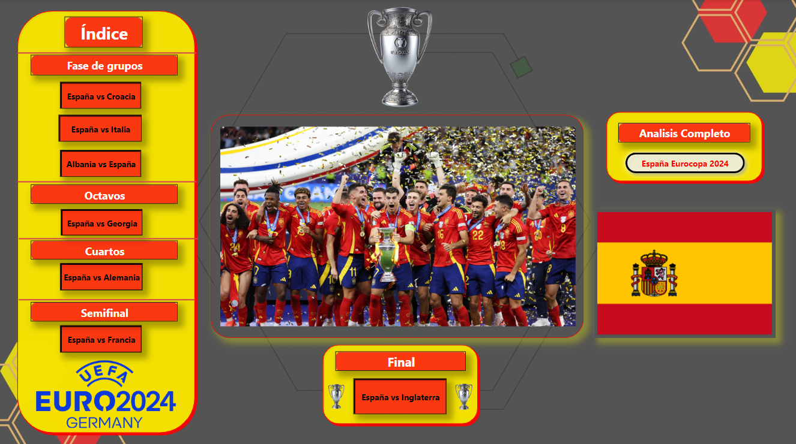

# ⚽ Análisis de Datos de la Eurocopa España 2024 ⚽


## Descripción

Este proyecto se centra en el análisis detallado del desempeño de la selección española en la Eurocopa 2024. Utilizando datos históricos y actuales, este análisis ofrece insights sobre los partidos, jugadores y estrategias del equipo. El objetivo es identificar patrones y tendencias que puedan ayudar a comprender mejor el rendimiento del equipo y predecir futuros resultados.

## Tabla de Contenidos

- [Instalación](#instalación)
- [Uso](#uso)
- [Estructura del Proyecto](#estructura-del-proyecto)
- [Contribuciones](#contribuciones)
- [Licencia](#licencia)
- [Contacto](#contacto)

## Instalación

1. Clona este repositorio:
    ```
    git clone https://github.com/miguelASL/Eurocopa_Espana.git
    ```
2. Navega al directorio del proyecto:
    ```
    cd Eurocopa_Espana
    ```
3. Instala las dependencias necesarias:
    ```
    pip install -r requirements.txt
    ```

## Uso

Para ejecutar el análisis, simplemente corre el script principal:
```
python main.py
```
Asegúrate de tener los datos en el formato correcto y ubicados en la carpeta data.

## Estructura del Proyecto

- **Videos**:
  - En esta carpeta tendremos un video de cada analisis que se realizo por partido.

- **data**:
  - En esta carpeta tendriamos todos los datos realizado en hojas de claculos de cada partido que disputo la seleccion española de futbol.
  
- **eurocopa.Report/**:
  - En esta carpeta se almacena los informes generados a partir del análisis de datos.

- **eurocopa.SemanticModel/**:
  - En esta carpeta tendremos los modelos semánticos y de machine learning desarrollados para el análisis.
 
- **graficas**:
  - En esta carpeta tendremos las imagenes que se generariian al ejecutar el script de python y tambien comando realizados en SQL.
 
- **eurocopa.pbix**:
  - Este es el archivo de los analisis de datos realizado en Power BI.

## Contribuciones
¡Las contribuciones son bienvenidas! Por favor, sigue los siguientes pasos:

- Haz un fork del proyecto y crea una nueva rama.
```
git checkout -b feature/nueva-funcionalidad
```
- Realiza tus cambios y haz commit.
```
git commit -am 'Agrega nueva funcionalidad'
```
- Sube los cambios.
```
git push origin feature/nueva-funcionalidad
```
- Abre un Pull Request.

## Licencia

Este proyecto está licenciado bajo la Licencia MIT.

## Contacto

**Email**: [](mailto:msarmientolevy@gmail.com)

**linkedin**: [](https://www.linkedin.com/in/miguel-sarmiento-)

**Enlace del Proyecto**: [](https://github.com/miguelASL/Eurocopa_Espana)
