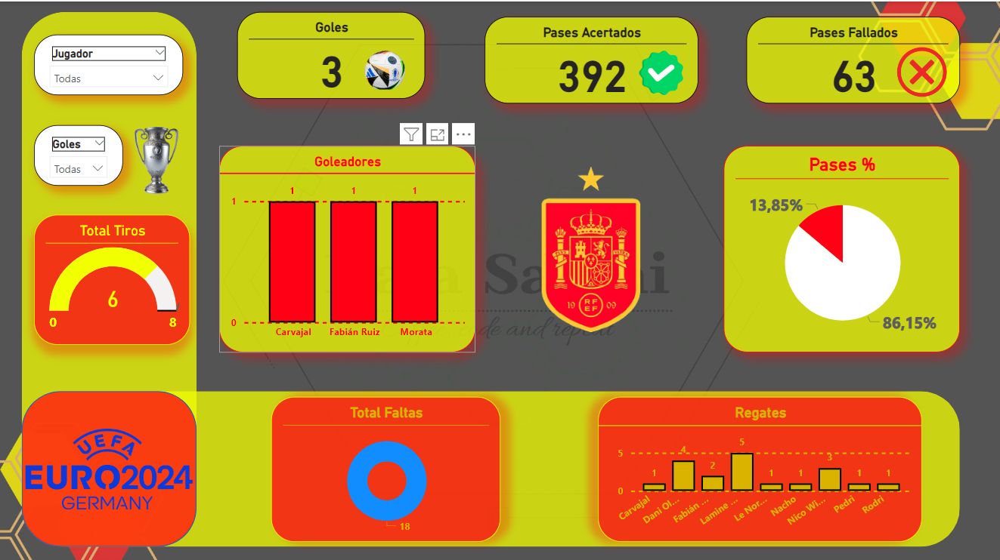

El primer partido de la selección española en la Eurocopa 2024 contra Croacia resultó en una emocionante victoria con un marcador de 3-1 a favor de España. A continuación, se presenta un análisis detallado de las estadísticas más relevantes del partido:

- Desempeño General del Equipo 📊
Goles: España anotó 3 goles en el partido, con los goles de Dani Carvajal, Fabián Ruiz y Álvaro Morata. ⚽️⚽️⚽️
Asistencias: Las asistencias vinieron de Fabián Ruiz, Pedri y Lamine Yamal, mostrando una buena distribución de juego y colaboración en el equipo. 🎯
Pases Completados: El equipo mostró un alto porcentaje de pases completados, destacando a Rodri con 57 pases completados de 64 intentados y Carvajal con 48 de 51. 🔝
Recuperaciones: Rodri y Carvajal fueron los más destacados en recuperaciones, con 5 y 8 respectivamente. 🛡️

- Actuaciones Destacadas 🌟
Dani Carvajal: Jugó los 90 minutos, anotó un gol y fue crucial en defensa con 8 recuperaciones y una precisión en pases del 94%. 🏅
Fabián Ruiz: También jugó los 90 minutos, anotó un gol y proporcionó una asistencia, mostrando una gran influencia en el mediocampo con 45 pases completados. 🎩
Unai Simón: El portero realizó 5 paradas cruciales, manteniendo la portería segura durante gran parte del partido. 🧤
Lamine Yamal: Con solo 17 años, Yamal destacó con una asistencia y 5 regates exitosos en 86 minutos de juego. 🔥

- Estadísticas Clave 📈
Minutos Jugados: Varios jugadores completaron los 90 minutos, mostrando gran resistencia y compromiso, incluyendo a Unai Simón, Carvajal, Le Normand, Nacho y Fabián Ruiz. ⏱️
Disparos a Puerta y Fuera: Morata y Carvajal fueron los más activos en ataque con 2 disparos a puerta y 1 fuera respectivamente. 🎯
Faltas Recibidas y Cometidas: Rodri recibió 5 faltas, siendo el jugador más marcado por los croatas, mientras que Cucurella fue el que más faltas cometió con 5. ⚠️

* Resumen Final 📝 *
España demostró una excelente coordinación y control del balón, con jugadores clave sobresaliendo en momentos cruciales. La solidez defensiva y la efectividad en el ataque fueron factores determinantes para asegurar la victoria en su primer partido de la Eurocopa 2024. 🏆

